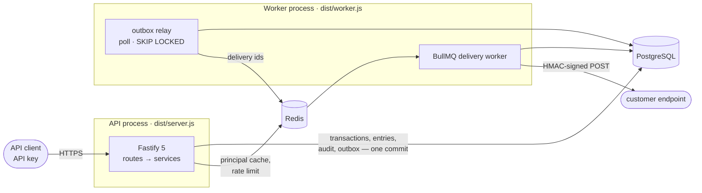

# LedgerFlow — Architecture

What is actually built, as built. Scope and intent are in
[PRODUCT.md](PRODUCT.md); decisions and their rejected alternatives are in
[adr/](adr/). Anything planned but not implemented is called out as such.

---

## 1. Shape of the system



Two processes from one image, differing only in command. Both are stateless; all
state is in Postgres and Redis. Redis is never the system of record: losing it
costs the auth cache, rate limiting and the delivery queue, and the outbox
refills the queue on recovery.

## 2. Repo layout

```
src/
  server.ts               listen, signal handling, graceful shutdown
  worker.ts               outbox poll loop + BullMQ delivery worker
  app.ts                  Fastify factory: plugins, routes, error handler
  config/env.ts           Zod-validated environment, fails fast at boot
  infra/                  db pool, drizzle schema, migrator, redis, logger, executor
  modules/
    auth/                 api-key.ts, auth.service, auth.plugin, auth.cache, roles
    ledger/               ledger.service (accounts, transactions, idempotency), routes, schemas
    audit/                audit.service — append-only writer
    outbox/               outbox.service (write), dispatcher (claim → fan out → enqueue)
    webhooks/             webhooks.service, delivery, signature, secret-crypto, url-guard, bullmq-queue
    health/               liveness and readiness
  shared/                 money, errors, error-handler
tests/                    vitest suite (unit, integration, property, contract)
scripts/                  generate-openapi.ts, verify-migrations.ts
drizzle/                  numbered SQL migrations + journal
load/                     k6 profile
```

Routes validate input with Zod and delegate; services own the rules and their
own Drizzle queries; `shared/` is pure. There is no separate repository layer and
no `eslint-plugin-boundaries` — at this size the extra indirection would buy
less than it costs, and services are small enough to read whole. The layering
that *is* enforced mechanically: every route must declare an access policy
(§7), and the balance invariant lives in the database (§3).

## 3. Data model

Actual tables (`src/infra/schema.ts`, migrations `drizzle/0000`–`0004`):

```
organizations(id, name, slug unique, created_at)

accounts(id, organization_id → organizations, name, reference, type, currency,
         created_at, unique(organization_id, reference),
         check currency ~ '^[A-Z]{3}$')

transactions(id, organization_id, description, currency, metadata jsonb,
             occurred_at, created_at)

entries(id, transaction_id → transactions, account_id → accounts,
        amount bigint check (amount <> 0), created_at)

idempotency_keys(id, organization_id, key, request_hash, response_body jsonb,
                 created_at, expires_at, unique(organization_id, key))

api_keys(id, organization_id, name, tag, prefix unique, secret_hash, role,
         created_at, last_used_at, revoked_at, revoked_reason)

audit_events(id, organization_id, actor_type, actor_id, action, resource_type,
             resource_id, request_id, ip, metadata jsonb, created_at)

outbox_events(id, organization_id, event_type, aggregate_type, aggregate_id,
              payload jsonb, status, available_at, created_at, dispatched_at)

webhook_endpoints(id, organization_id, url, description, event_types,
                  secret_ciphertext, status, consecutive_failures, ...)

webhook_deliveries(id, endpoint_id, outbox_event_id, status, attempt,
                   next_attempt_at, response_status, error, ...,
                   unique(endpoint_id, outbox_event_id))
```

Notes on what this is *not*: there is no `ledgers` table (accounts hang directly
off an organization, and currency is enforced per account and per transaction),
no `holds`, and no `account_balances` cache.

**Entries are signed.** An entry amount is a positive or negative `BIGINT` in
minor units; a transaction is balanced when its entries sum to zero. There is no
`direction` enum — the sign carries it, which makes the invariant one `SUM()` and
removes a class of "debit stored as credit" bugs. Money is never a float
([ADR-0002](adr/0002-bigint-minor-units.md)).

### The invariant

```sql
CREATE CONSTRAINT TRIGGER entries_balanced_check
  AFTER INSERT OR UPDATE OR DELETE ON entries
  DEFERRABLE INITIALLY DEFERRED
  FOR EACH ROW EXECUTE FUNCTION ledger_assert_transaction_balanced();
```

At `COMMIT`, for each touched `transaction_id`, the function requires at least
two entries and `SUM(amount) = 0`, raising `check_violation` otherwise. Deferred
because entries are inserted row by row. No application path — and no `psql`
session run by a tired on-call engineer — can leave imbalanced money behind.
`tests/ledger-properties.test.ts` and `scripts/verify-migrations.ts` both assert
this against a live database.

Corrections are new transactions. A reversal *endpoint* is not implemented; the
same effect is available today by posting the inverse entries.

### Balances

Derived, always: `GET /v1/accounts/{id}` returns `SUM(entries.amount)` for the
account plus an entry count. There is no cache and therefore no drift, no
reconciliation job and no cache-invalidation bug — at the cost of read time
growing with history.
[ADR-0004](adr/0004-balance-cache-with-reconciliation.md) records the cached
design and why it is deferred rather than built.

## 4. Request lifecycle: `POST /v1/transactions`

1. **Request id** — inbound `x-request-id` or a generated one; attached to the
   child logger, echoed on the response and in every error body.
2. **Auth hook** (`modules/auth/auth.plugin.ts`) — `Authorization: Bearer` or
   `X-Api-Key`. Parse `lf_<tag>_<prefix>.<secret>`, look up by the indexed
   `prefix`, compare a peppered HMAC-SHA256 in constant time, then cache the
   verified principal in Redis under a SHA-256 of the presented token for
   `AUTH_CACHE_TTL_SECONDS`. Revocation writes a tombstone checked on every cache
   hit, so a revoked key stops working immediately rather than within one TTL
   ([ADR-0007](adr/0007-api-key-auth-and-tenant-isolation.md)).
3. **Role check** — the route's declared policy, fail-closed to admin.
4. **Rate limit** — two buckets, both `@fastify/rate-limit` backed by Redis in
   production so the budget is shared across instances:
   an **IP bucket** in `onRequest` *before* authentication
   (`RATE_LIMIT_IP_MAX` per `RATE_LIMIT_WINDOW_MS`, plus a tighter
   `RATE_LIMIT_BOOTSTRAP_MAX` on the bootstrap route), and an **API-key bucket**
   in `preHandler` once the principal is known (`RATE_LIMIT_MAX`). `request.ip`
   is only derived from `X-Forwarded-For` when `TRUST_PROXY` names the proxy
   (hop count or CIDR list); the default is `false`, so the key cannot be
   spoofed.
5. **Validation** — Zod, the same schemas that generate `openapi.json`;
   `tests/openapi-contract.test.ts` fails if the committed document drifts.
6. **Service** (`ledger.service.ts`) — sum the entry amounts, reject a non-zero
   sum or any zero amount before touching the database, then in **one database
   transaction**:
   - insert the `idempotency_keys` row first, so two concurrent requests with the
     same key contend on a unique index instead of both writing entries;
   - `SELECT … FOR UPDATE` the referenced accounts (deterministic set), verifying
     they belong to this organization and match the transaction currency;
   - insert the transaction and its entries;
   - write the `audit_events` row and the `outbox_events` row;
   - store the serialized response on the idempotency row.
7. **Commit** — the deferred trigger runs here; a violation aborts everything.
8. **Response** — `201` with the transaction and entries. A replay of the same
   key with the same body returns the stored response; a different body returns
   `409`.

The outbox row and the money commit together: no event without money moved, no
money moved without an event. `tests/audit-outbox.test.ts` asserts both
directions.

## 5. Webhooks

Operator-facing contract: [WEBHOOKS.md](WEBHOOKS.md).

- **Relay:** the worker polls `outbox_events` where `status='pending'` and
  `available_at <= now()` with `FOR UPDATE SKIP LOCKED`
  (`OUTBOX_BATCH_SIZE`, every `OUTBOX_POLL_INTERVAL_MS`), inserts one
  `webhook_deliveries` row per matching active endpoint inside the claim
  transaction, marks the event dispatched, then enqueues one BullMQ job per
  delivery. Polling rather than `LISTEN/NOTIFY` because poolers make `NOTIFY`
  unreliable ([ADR-0005](adr/0005-outbox-bullmq-webhooks.md)).
- **Duplicate safety:** `unique(endpoint_id, outbox_event_id)` means a crash mid
  dispatch, or a deliberate replay, can never create a second delivery row. Jobs
  carry only a delivery id and the executor re-reads status before acting.
- **Ordering is not guaranteed.** Per-group ordering is a BullMQ Pro feature; the
  original plan did not survive contact with the open-source package, and the
  correction is recorded in ADR-0005. Receivers deduplicate on the event id.
- **Signing:** `X-LedgerFlow-Signature: v1=<hex hmac_sha256(secret, timestamp + "." + rawBody)>`
  with `X-LedgerFlow-Timestamp`; receivers should reject skew beyond 300 s.
  Secrets are shown once and stored AES-256-GCM encrypted, because signing needs
  the plaintext ([ADR-0008](adr/0008-webhook-secret-encryption.md)). Rotation is
  a single admin call and replaces the secret; dual-secret overlap is not
  implemented.
- **Retries:** `WEBHOOK_MAX_ATTEMPTS` attempts with full-jitter exponential
  backoff (`WEBHOOK_BACKOFF_BASE_MS` → `WEBHOOK_BACKOFF_MAX_MS`), tracked in
  Postgres. BullMQ jobs use `attempts: 1` so the delivery row stays the single
  source of truth. Retryable: transport errors, timeouts, `5xx`, `408`, `429`.
  Everything else, plus disabled endpoints and URLs failing the SSRF guard, goes
  straight to `dead_letter`, listable and replayable via the API.
  `consecutive_failures` is tracked and exposed, but auto-disabling an endpoint
  is not implemented.
- **SSRF:** scheme, credential, port and private-range checks at registration and
  again before every attempt, DNS answers re-validated per attempt, redirects not
  followed. Residual DNS-rebinding risk is documented in WEBHOOKS.md.
- **Audit:** `audit_events` is append-only (a trigger rejects `UPDATE`/`DELETE`)
  and records money movements, key lifecycle, and every webhook mutation or
  replay with actor, request id and IP.

## 6. Holds

Not implemented. Authorization/capture semantics are described in PRODUCT.md as
future work; nothing in the schema or API pretends otherwise.

## 7. AuthZ

**Tenant isolation:** every service function takes the `organizationId` from the
verified principal — never from a header or body — and every query filters on
it. A resource belonging to another organization returns `404`, not `403`, so
existence is not leaked; `tests/auth.test.ts` probes this across endpoints.

**RBAC:** a strict hierarchy, `admin` > `writer` > `reader`. Every route declares
`config.policy` (`{ public: true }` or `{ role }`); the auth hook fails closed to
admin-only when a declaration is missing, and a route-table test fails if any
route omits one — a new endpoint cannot ship unauthenticated by accident.
Finer-grained scopes are not implemented.

## 8. Testing

| Layer       | Tool                                | What                                                                          |
| ----------- | ----------------------------------- | ------------------------------------------------------------------------------- |
| Unit        | Vitest                              | Minor-unit parsing, env validation, log redaction, signing, SSRF guard         |
| Integration | Vitest + `fastify.inject` + Postgres | Every route against a real database: ledger, auth, webhooks, audit, outbox    |
| Property    | fast-check                          | Trial balance stays zero, balances are derivable, unbalanced input never lands |
| Contract    | Vitest                              | Committed `openapi.json` matches generated output; all routes authenticated    |
| Redis       | Vitest + ioredis/BullMQ             | Real cache and queue wiring; skipped (loudly) when no Redis is reachable       |
| Migration   | `scripts/verify-migrations.ts`      | Apply, re-apply, inspect schema objects, and prove the invariant at `COMMIT`    |

The database under test is PGlite speaking the Postgres wire protocol, so the
real `pg` driver, SQL and triggers are exercised without requiring Docker;
`TEST_DATABASE_URL` swaps in a real server, which is what CI does. Details and
the coverage policy: [DEVELOPMENT.md](DEVELOPMENT.md).

## 9. CI/CD

`.github/workflows/ci.yml`, jobs in parallel: `static` (eslint, `tsc --noEmit`,
prettier) · `test` (coverage thresholds, against `postgres:17` and `redis:7`
service containers) · `migrations` (`npm run db:verify` against real Postgres) ·
`contract` (regenerate `openapi.json`, `git diff --exit-code`) · `audit`
(`npm audit --omit=dev` blocking, full audit advisory) · `docker` (buildx with
layer cache).

Deployment is a Render blueprint with a pre-deploy migration command; the
expand/contract rule and rollback story are in [DEPLOYMENT.md](DEPLOYMENT.md).

Migration `0004` backfills `entries.organization_id` from `transactions` with a
full-table update before enforcing the tenant foreign keys. For a large existing
ledger, run that backfill in planned batches ahead of deployment rather than
holding the migration transaction open during peak traffic.

## 10. Runtime choices

- **Node 22, TypeScript strict, ESM.** `tsx` in development, `tsc` to `dist`, no
  bundler.
- **Fastify 5** over Express: schema-first validation, better throughput, real
  plugin encapsulation ([ADR-0001](adr/0001-fastify-over-express-and-nest.md)).
- **Drizzle** over Prisma: real SQL semantics (`FOR UPDATE`, CTEs), no query
  engine binary, migrations are readable SQL
  ([ADR-0003](adr/0003-drizzle-over-prisma.md)).
- **BullMQ on Redis** over pg-boss: Redis is already there for caching and rate
  limiting ([ADR-0005](adr/0005-outbox-bullmq-webhooks.md)).
- **pino** JSON logs with redaction of `authorization`, secrets and keys,
  request-scoped child loggers.
- **Deployment:** Render (web + worker), managed Postgres, managed Redis.

## 11. Failure modes

| Failure                        | Behaviour                                                                                                                             |
| ------------------------------ | --------------------------------------------------------------------------------------------------------------------------------------- |
| Redis down                     | Auth verification falls back to Postgres on every request (slower, still correct); readiness reports `degraded`; webhook enqueue fails and outbox rows stay pending until recovery. The money path keeps working. |
| Postgres unavailable           | Writes fail loudly; `/health/ready` returns `503` so the instance leaves rotation; idempotency keys make client retries safe.          |
| Duplicate client submit        | Same `Idempotency-Key` + same body replays the stored response; different body is rejected with `409`. No double post.                 |
| Concurrent transfers           | Accounts are locked with `SELECT … FOR UPDATE` inside the write transaction; the deferred trigger is the final arbiter at `COMMIT`.    |
| Worker down                    | Outbox accumulates and drains on restart; deliveries are late, never lost.                                                             |
| Receiver down                  | Backoff up to `WEBHOOK_BACKOFF_MAX_MS`, then `dead_letter`, listable and replayable. No auto-disable.                                  |
| Leaked API key                 | `DELETE /v1/api-keys/{id}` writes a Redis tombstone, so cached copies die on the next request rather than one TTL later.               |

## 12. Deliberate limits

Single Postgres primary, no partitioning. Balances are recomputed on every read,
so read cost grows with entry count — the first thing to change under real load,
and the reason ADR-0004 exists. No holds, no FX, no multi-region, no reversal
endpoint, no scoped permissions, no metrics endpoint. Rate limiting is
per-instance rather than shared through Redis, so the effective limit multiplies
by the number of API instances.

These are written down because a project should show where it stops.
